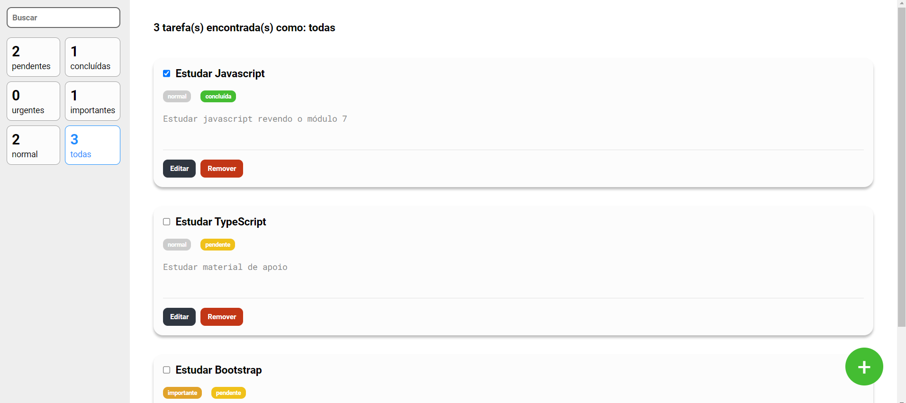

# Todo List com React

Este é um projeto de Todo List desenvolvido em React, criado utilizando o `create-react-app`. O objetivo deste projeto é gerenciar tarefas, permitindo criar, editar, remover e filtrar tarefas de acordo com diferentes critérios.

## Funcionalidades

- **Criação de Tarefas:** 
  - Um botão "Criar Tarefa" (representado por um "+" no canto inferior direito da tela) permite adicionar novas tarefas à lista.
  
- **Edição de Tarefas:** 
  - Cada tarefa possui um botão "Editar" que permite alterar a descrição da tarefa. Ao clicar em "Editar", os botões "Salvar" e "Cancelar" substituem os botões padrão, permitindo salvar as alterações ou cancelar a edição.

- **Remoção de Tarefas:** 
  - Cada tarefa possui um botão "Remover" que permite excluir a tarefa da lista.
  
- **Filtros:** 
  - As tarefas podem ser filtradas por **status** (pendente ou concluída) e por **prioridade** (normal, urgente, importante).

- **Etiquetas:** 
  - Cada tarefa exibe etiquetas que indicam seu status e prioridade.

- **Menu Hamburguer:** 
  - Um menu hamburguer foi adicionado para melhorar a experiência do usuário em dispositivos móveis, permitindo fácil acesso às funcionalidades principais.

## Tecnologias Utilizadas

- **React:** Biblioteca JavaScript para a construção de interfaces de usuário.
- **Create React App:** Ferramenta para a criação de novos projetos React com configuração mínima.

## Demonstração da aplicação

[Demo](https://todo-react-peach-three.vercel.app/)
